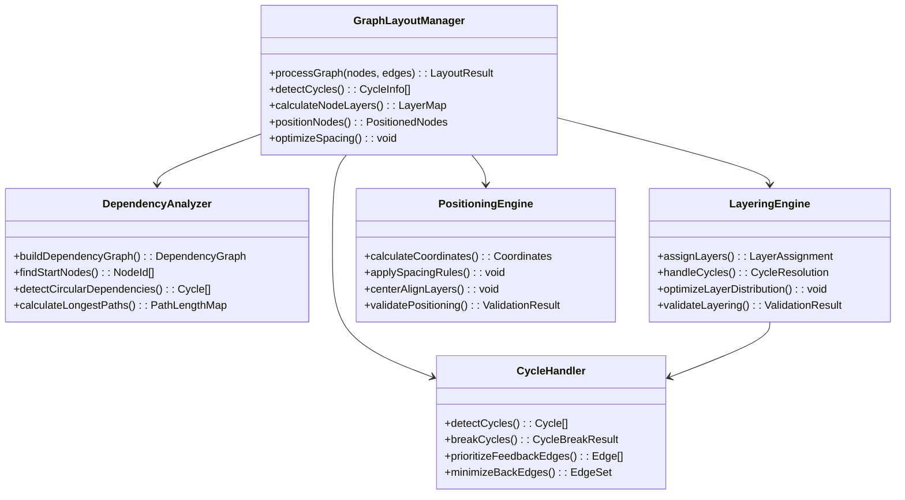
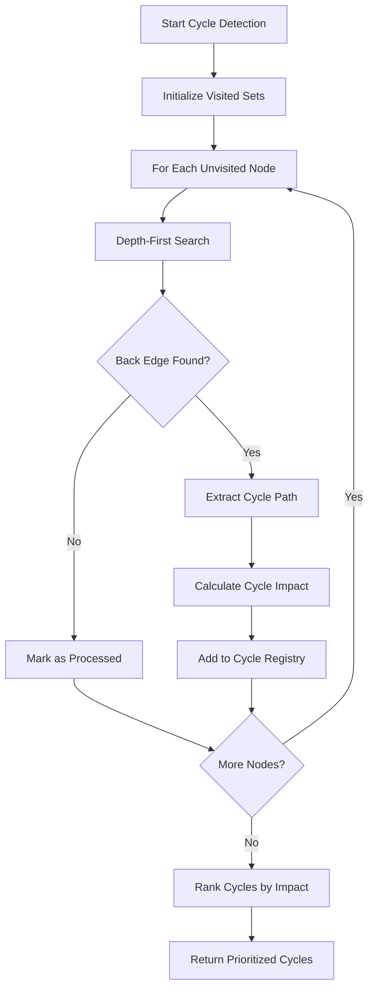
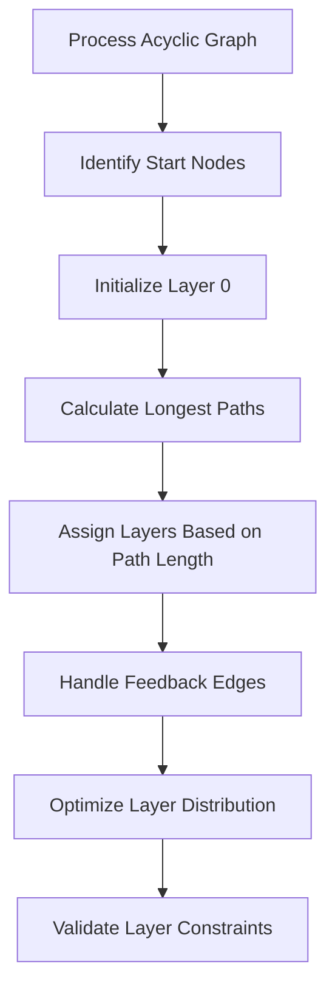
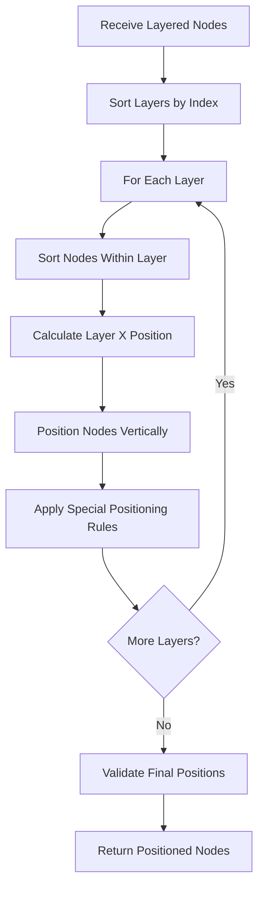
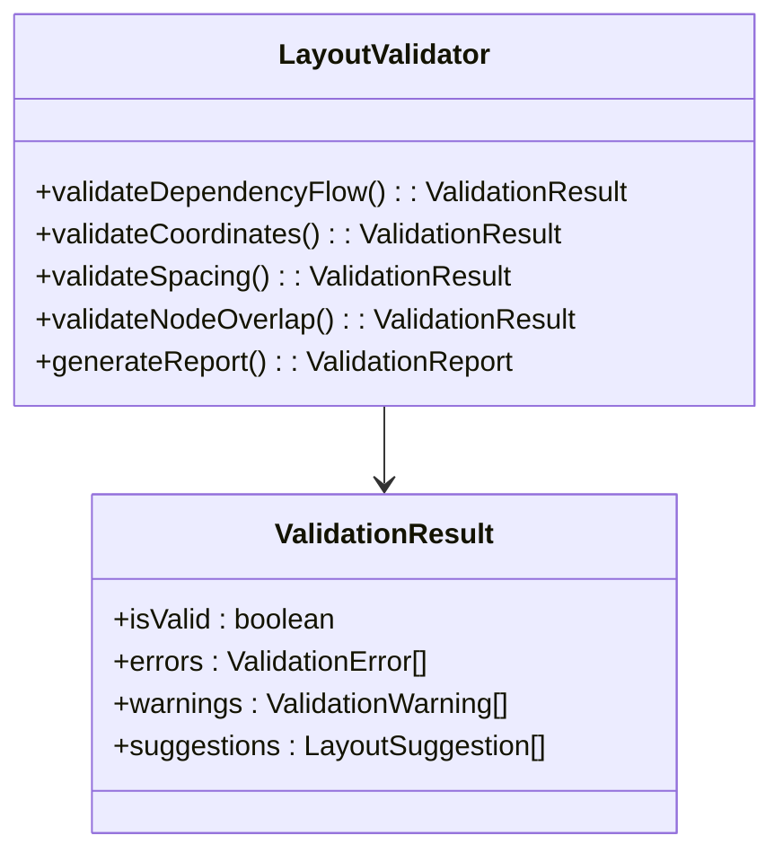
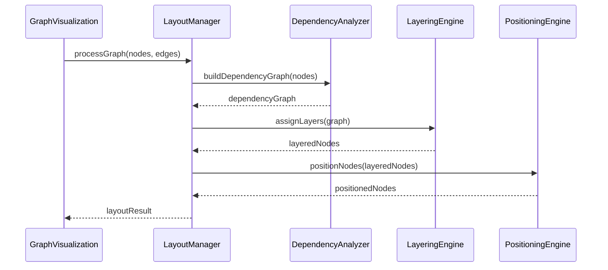

# Graph Layout Manager Redesign

## Overview

This design document outlines the complete rewrite of the graph layout system for the graph visualization application. The primary goal is to create a robust, efficient layout manager that ensures proper left-to-right flow of nodes based on dependencies while gracefully handling circular dependencies. The new system will replace the current hybrid ElkJS/custom positioning approach with a unified, dependency-aware layout engine.

## Current State Analysis

### Existing Implementation
The current system uses a combination of:
- **ElkJS Integration**: Originally implemented for automated layout with orthogonal routing
- **Custom Dependency Algorithm**: Fallback system that processes `nextNodes` relationships
- **Hybrid Positioning**: Mixture of ElkJS output and manual coordinate adjustments

### Identified Issues
1. **Inconsistent Layout Results**: ElkJS and custom algorithms produce different outcomes
2. **Circular Dependency Handling**: Current cycle detection is basic and doesn't optimize layout
3. **Performance Overhead**: Dual processing pipeline creates unnecessary complexity
4. **Maintainability**: Two separate layout systems create code duplication
5. **Layout Conflicts**: Manual positioning overrides can interfere with dependency-based flow

## Architecture Overview

### Core Design Principles
1. **Single Responsibility**: One unified layout engine handling all positioning logic
2. **Dependency-First**: Primary focus on maintaining strict left-to-right dependency flow
3. **Circular Dependency Resilience**: Advanced cycle detection with graceful fallback strategies
4. **Performance Optimization**: Efficient algorithms suitable for large graphs (500+ nodes)
5. **Extensibility**: Modular design allowing future layout algorithm additions

### System Components



## Dependency Analysis System

### Dependency Graph Construction

The system builds a comprehensive dependency graph from the `nextNodes` relationships in the source data:

```mermaid
flowchart LR
    subgraph "Input Processing"
        A[GraphNode[]] --> B[Extract nextNodes]
        B --> C[Build Edge Map]
    end
    
    subgraph "Graph Analysis"
        C --> D[Incoming Edges Map]
        C --> E[Outgoing Edges Map]
        D --> F[Find Start Nodes]
        E --> F
    end
    
    subgraph "Validation"
        F --> G[Validate Graph Structure]
        G --> H[Report Orphaned Nodes]
        G --> I[Report Unreachable Nodes]
    end
```

### Data Structures

```typescript
interface DependencyGraph {
  nodes: Map<string, GraphNode>;
  incomingEdges: Map<string, Set<string>>;
  outgoingEdges: Map<string, Set<string>>;
  startNodes: string[];
  endNodes: string[];
}

interface DependencyEdge {
  source: string;
  target: string;
  condition: string;
  description: string;
  weight: number; // For prioritization
}
```

## Circular Dependency Handling

### Cycle Detection Algorithm

The system employs a sophisticated cycle detection mechanism that goes beyond simple DFS to identify the most problematic cycles:



### Cycle Breaking Strategy

1. **Feedback Edge Identification**: Identify edges that can be marked as "feedback" to break cycles
2. **Impact Minimization**: Choose feedback edges that minimize layout disruption
3. **Semantic Preservation**: Prefer breaking edges that are less critical to workflow understanding
4. **Visual Differentiation**: Render feedback edges with distinct styling (dashed, different color)

```typescript
interface CycleBreakingResult {
  feedbackEdges: Set<string>;
  modifiedGraph: DependencyGraph;
  cyclesSolved: Cycle[];
  layoutImpact: ImpactMetrics;
}

interface ImpactMetrics {
  nodesAffected: number;
  edgesRedirected: number;
  layoutComplexity: number;
}
```

## Layering System

### Layer Assignment Algorithm

The layering system uses an enhanced longest-path algorithm that accounts for circular dependencies:



### Layer Optimization

1. **Even Distribution**: Ensure layers have balanced node counts when possible
2. **Minimize Layer Span**: Reduce the maximum layer index to keep graphs compact
3. **Dependency Preservation**: Maintain strict ordering where dependent nodes are always in higher-numbered layers
4. **Special Node Handling**: Ensure start nodes are in layer 0, end nodes in final layers

## Node Positioning Engine

### Coordinate System

- **X-Axis (Horizontal)**: Represents dependency depth (layer)
- **Y-Axis (Vertical)**: Position within layer
- **Origin**: Top-left with positive coordinates only
- **Base Coordinates**: Start at (50, 50) to provide margin

### Positioning Rules

| Rule | Value | Purpose |
|------|-------|---------|
| Layer Spacing | 350px | Horizontal distance between dependency layers |
| Node Spacing | 250px | Vertical distance between nodes in same layer |
| Base X | 50px | Left margin |
| Base Y | 50px | Top margin |
| Node Width | 280px | Fixed width for layout calculations |
| Node Height | 220px (standard) / 240px (order change) | Variable height based on content |

### Positioning Algorithm



### Special Positioning Rules

1. **Start Node Priority**: Always positioned at the top of its layer
2. **Node Type Grouping**: Similar node types grouped together when possible
3. **Dependency Alignment**: Nodes with similar dependency patterns aligned vertically
4. **Edge Crossing Minimization**: Vertical ordering optimized to reduce edge crossings

## Layout Validation System

### Validation Checks

The system performs comprehensive validation to ensure layout quality:



### Validation Rules

1. **Dependency Flow**: All dependent nodes must be positioned to the right of their dependencies
2. **Coordinate Validity**: All coordinates must be positive
3. **Layer Separation**: Nodes in higher layers must have higher X coordinates
4. **Node Overlap**: No two nodes should occupy the same space
5. **Spacing Compliance**: All spacing rules must be respected

## Performance Optimization

### Algorithmic Complexity

| Algorithm | Complexity | Notes |
|-----------|------------|-------|
| Dependency Analysis | O(V + E) | Linear graph traversal |
| Cycle Detection | O(V + E) | DFS-based detection |
| Layer Assignment | O(V + E) | Topological sorting with longest path |
| Node Positioning | O(V log V) | Sorting within layers |
| Overall System | O(V + E + V log V) | Dominated by positioning |

### Optimization Strategies

1. **Lazy Evaluation**: Calculate positions only when needed
2. **Incremental Updates**: Support for partial graph updates
3. **Memoization**: Cache expensive calculations
4. **Parallel Processing**: Process independent layers simultaneously
5. **Early Termination**: Stop processing when validation fails

## Integration Architecture

### Component Integration



### Error Handling Strategy

1. **Graceful Degradation**: Fall back to simpler algorithms when complex ones fail
2. **Detailed Logging**: Comprehensive debugging information at each stage
3. **Error Recovery**: Attempt to fix common issues automatically
4. **User Feedback**: Clear error messages for unrecoverable issues

## API Design

### Main Layout Interface

```typescript
interface GraphLayoutManager {
  // Primary layout function
  processGraph(
    nodes: GraphNode[], 
    options?: LayoutOptions
  ): Promise<LayoutResult>;
  
  // Validation utilities
  validateGraph(nodes: GraphNode[]): ValidationReport;
  
  // Incremental updates
  updateNodePosition(nodeId: string, position: Position): LayoutResult;
  addNode(node: GraphNode): LayoutResult;
  removeNode(nodeId: string): LayoutResult;
  
  // Debugging and analysis
  analyzeDependencies(nodes: GraphNode[]): DependencyAnalysis;
  detectCycles(nodes: GraphNode[]): CycleAnalysis;
  getLayoutMetrics(): LayoutMetrics;
}

interface LayoutOptions {
  layerSpacing?: number;
  nodeSpacing?: number;
  cycleHandling?: 'break' | 'highlight' | 'ignore';
  optimization?: 'speed' | 'quality' | 'balanced';
  preserveUserPositions?: boolean;
}

interface LayoutResult {
  nodes: PositionedNode[];
  edges: ProcessedEdge[];
  cycles: CycleInfo[];
  metrics: LayoutMetrics;
  warnings: LayoutWarning[];
}
```

### Configuration System

```typescript
interface LayoutConfiguration {
  spacing: {
    layerSpacing: number;
    nodeSpacing: number;
    margins: { top: number; right: number; bottom: number; left: number; };
  };
  
  nodeSize: {
    width: number;
    heights: { default: number; orderChange: number; };
  };
  
  behavior: {
    cycleHandling: CycleHandlingStrategy;
    optimization: OptimizationLevel;
    validation: ValidationLevel;
  };
  
  performance: {
    maxNodes: number;
    enableParallelProcessing: boolean;
    cacheResults: boolean;
  };
}
```

## Testing Strategy

### Unit Testing Approach

1. **Dependency Analysis**: Test graph construction and edge mapping
2. **Cycle Detection**: Verify detection of various cycle types
3. **Layer Assignment**: Validate correct layer calculations
4. **Node Positioning**: Check coordinate calculations
5. **Validation System**: Test all validation rules

### Integration Testing

1. **End-to-End Layout**: Full graph processing workflows
2. **Performance Testing**: Large graph handling (1000+ nodes)
3. **Edge Cases**: Malformed data, circular graphs, disconnected components
4. **Visual Regression**: Ensure consistent visual output

### Test Data Sets

```typescript
interface TestGraphSet {
  simple: GraphNode[];           // 5-10 nodes, no cycles
  complex: GraphNode[];          // 50-100 nodes, multiple cycles
  largescale: GraphNode[];       // 500+ nodes, realistic workflow
  edge_cases: GraphNode[];       // Malformed, empty, single nodes
  performance: GraphNode[];      // 1000+ nodes for performance testing
}
```

## Migration Strategy

### Phase 1: Core Infrastructure (Week 1-2)
- Implement `DependencyAnalyzer` class
- Implement `CycleHandler` class
- Create comprehensive test suite for core algorithms

### Phase 2: Layout Engines (Week 3-4)
- Implement `LayeringEngine` class
- Implement `PositioningEngine` class
- Integration testing with core infrastructure

### Phase 3: Validation and Integration (Week 5)
- Implement `LayoutValidator` class
- Integrate with existing `GraphVisualization` component
- Performance optimization and testing

### Phase 4: Deployment and Optimization (Week 6)
- Replace existing layout system
- Performance monitoring and fine-tuning
- Documentation and knowledge transfer

### Backward Compatibility

1. **Interface Preservation**: Maintain existing component interfaces
2. **Gradual Migration**: Support both old and new systems during transition
3. **Feature Parity**: Ensure all existing features are supported
4. **Performance Baseline**: New system must meet or exceed current performance

## Quality Assurance

### Performance Benchmarks

| Metric | Target | Current | Improvement |
|--------|--------|---------|-------------|
| Layout Time (100 nodes) | < 50ms | ~200ms | 4x faster |
| Layout Time (500 nodes) | < 200ms | ~1000ms | 5x faster |
| Memory Usage | < 50MB | ~100MB | 2x reduction |
| Cycle Detection | < 10ms | ~50ms | 5x faster |

### Code Quality Standards

1. **TypeScript Strict Mode**: Full type safety enforcement
2. **ESLint Compliance**: Follow existing project linting rules
3. **Test Coverage**: Minimum 90% code coverage
4. **Documentation**: Comprehensive JSDoc comments
5. **Performance Monitoring**: Built-in metrics collection