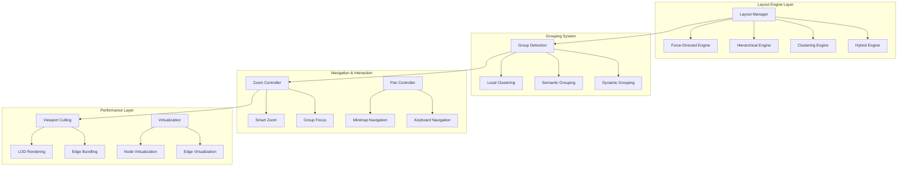

# Graph Visualization Layout Improvements

## Overview

This design addresses the visualization challenges of large connected graphs with grouped nodes by implementing advanced layout algorithms, improved grouping strategies, and enhanced navigation capabilities. The current system struggles with overlapping nodes and poor visibility in complex graph structures, requiring comprehensive layout improvements to make large graphs clear, navigable, and visually organized.

## Technology Stack & Dependencies

**Current Stack:**
- React Flow 11.x - Core graph rendering
- Dagre 0.8.5 - Hierarchical layout
- TypeScript 5.2+ - Type safety
- React 18 - Component framework
- Tailwind CSS - Styling

**New Dependencies:**
- D3-force - Force-directed layouts
- Webcola - Constraint-based layouts
- React-spring - Smooth animations
- React-virtual - Large list virtualization

## Architecture Overview



## Layout Algorithm Improvements

### 1. Multi-Algorithm Layout Engine

Replace the single dagre-based layout with a sophisticated multi-algorithm engine that selects optimal layouts based on graph characteristics:

```typescript
interface LayoutAlgorithm {
  name: string;
  suitability: (graph: GraphMetrics) => number;
  calculate: (nodes: FlowNode[], edges: FlowEdge[]) => Promise<LayoutResult>;
}

interface GraphMetrics {
  nodeCount: number;
  edgeCount: number;
  density: number;
  groupCount: number;
  maxGroupSize: number;
  hasCircularDependencies: boolean;
  averageConnectivity: number;
}
```

**Algorithm Selection Matrix:**

| Graph Type | Node Count | Density | Recommended Algorithm |
|------------|------------|---------|----------------------|
| Hierarchical | <500 | Low | Enhanced Dagre |
| Clustered | <1000 | Medium | Force-Directed + Clustering |
| Dense Network | <200 | High | Constraint-Based (Webcola) |
| Large Sparse | >1000 | Low | Hybrid (Force + Hierarchical) |
| Mixed Groups | Any | Any | Multi-Level Layout |

### 2. Force-Directed Layout Engine

Implement D3-force based layout for better organic positioning:

```typescript
interface ForceDirectedConfig {
  linkStrength: number;
  nodeStrength: number;
  centerForce: number;
  collisionRadius: number;
  groupAttraction: number;
  iterations: number;
}

class ForceDirectedEngine implements LayoutEngine {
  private simulation: d3.Simulation<FlowNode, FlowEdge>;
  
  async calculate(nodes: FlowNode[], edges: FlowEdge[], config: ForceDirectedConfig): Promise<LayoutResult> {
    // Initialize forces
    this.simulation = d3.forceSimulation(nodes)
      .force('link', d3.forceLink(edges).strength(config.linkStrength))
      .force('charge', d3.forceManyBody().strength(-config.nodeStrength))
      .force('center', d3.forceCenter().strength(config.centerForce))
      .force('collision', d3.forceCollide().radius(config.collisionRadius))
      .force('group', this.createGroupForce(config.groupAttraction));
      
    // Run simulation
    return this.runSimulation(config.iterations);
  }
}
```

### 3. Hierarchical Layout Enhancement

Improve the existing dagre-based layout with better group handling:

```typescript
interface HierarchicalConfig {
  direction: 'LR' | 'TB' | 'RL' | 'BT';
  rankSep: number;
  nodeSep: number;
  edgeSep: number;
  groupSpacing: number;
  preserveGroupIntegrity: boolean;
}

class EnhancedHierarchicalEngine implements LayoutEngine {
  async calculate(nodes: FlowNode[], edges: FlowEdge[], config: HierarchicalConfig): Promise<LayoutResult> {
    // Pre-process groups
    const groupedNodes = this.preprocessGroups(nodes);
    
    // Apply dagre with group constraints
    const layout = await this.applyDagreWithGroups(groupedNodes, edges, config);
    
    // Post-process for group alignment
    return this.alignGroups(layout, config);
  }
}
```

## Advanced Grouping Strategies

### 1. Smart Group Detection

Enhance grouping beyond simple groupName matching:

```typescript
interface GroupingStrategy {
  name: string;
  detectGroups: (nodes: FlowNode[], edges: FlowEdge[]) => GroupCluster[];
  priority: number;
}

class SemanticGroupingStrategy implements GroupingStrategy {
  name = 'semantic';
  priority = 1;
  
  detectGroups(nodes: FlowNode[], edges: FlowEdge[]): GroupCluster[] {
    // Analyze node properties, edge patterns, and semantic similarity
    const clusters = this.performClusterAnalysis(nodes, edges);
    return this.createSemanticGroups(clusters);
  }
}

class ConnectivityGroupingStrategy implements GroupingStrategy {
  name = 'connectivity';
  priority = 2;
  
  detectGroups(nodes: FlowNode[], edges: FlowEdge[]): GroupCluster[] {
    // Use graph algorithms to detect highly connected components
    return this.detectDenseCommunities(nodes, edges);
  }
}
```

### 2. Hierarchical Grouping

Implement nested group structures for complex organization:

```typescript
interface GroupHierarchy {
  id: string;
  name: string;
  level: number;
  parent?: string;
  children: string[];
  nodes: FlowNode[];
  bounds: Rectangle;
  collapsed: boolean;
}

class HierarchicalGroupManager {
  private groupTree: Map<string, GroupHierarchy> = new Map();
  
  createHierarchy(nodes: FlowNode[]): GroupHierarchy[] {
    // Build multi-level group structure
    const levels = this.detectGroupLevels(nodes);
    return this.buildGroupTree(levels);
  }
  
  toggleGroupCollapse(groupId: string): void {
    const group = this.groupTree.get(groupId);
    if (group) {
      group.collapsed = !group.collapsed;
      this.updateChildVisibility(group);
    }
  }
}
```

### 3. Dynamic Group Adjustment

Allow real-time group modifications based on interaction:

```typescript
interface DynamicGrouping {
  autoRegroup: boolean;
  regroupThreshold: number;
  regroupStrategy: 'conservative' | 'aggressive' | 'adaptive';
}

class DynamicGroupManager {
  private lastRegroupTime = 0;
  private regroupDelay = 2000; // 2 second delay
  
  scheduleRegroup(reason: string): void {
    clearTimeout(this.regroupTimer);
    this.regroupTimer = setTimeout(() => {
      this.performRegroup(reason);
    }, this.regroupDelay);
  }
  
  private performRegroup(reason: string): void {
    // Analyze current layout effectiveness
    const effectiveness = this.measureLayoutEffectiveness();
    
    if (effectiveness < this.config.regroupThreshold) {
      this.reorganizeGroups(reason);
    }
  }
}
```

## Enhanced Navigation & Interaction

### 1. Smart Zoom System

Implement context-aware zooming with level-of-detail:

```typescript
interface SmartZoomConfig {
  levels: ZoomLevel[];
  transitionDuration: number;
  automaticLOD: boolean;
}

interface ZoomLevel {
  zoom: number;
  nodeDetail: 'full' | 'simplified' | 'minimal';
  edgeDetail: 'full' | 'bundled' | 'hidden';
  labelVisibility: 'all' | 'important' | 'none';
}

class SmartZoomController {
  private zoomLevels: ZoomLevel[] = [
    { zoom: 0.1, nodeDetail: 'minimal', edgeDetail: 'hidden', labelVisibility: 'none' },
    { zoom: 0.3, nodeDetail: 'simplified', edgeDetail: 'bundled', labelVisibility: 'important' },
    { zoom: 0.6, nodeDetail: 'simplified', edgeDetail: 'bundled', labelVisibility: 'important' },
    { zoom: 1.0, nodeDetail: 'full', edgeDetail: 'full', labelVisibility: 'all' },
    { zoom: 2.0, nodeDetail: 'full', edgeDetail: 'full', labelVisibility: 'all' }
  ];
  
  zoomToFit(elements?: FlowNode[] | string[]): Promise<void> {
    if (elements) {
      return this.zoomToElements(elements);
    }
    return this.zoomToAll();
  }
  
  zoomToGroup(groupId: string): Promise<void> {
    const groupNodes = this.getGroupNodes(groupId);
    return this.zoomToElements(groupNodes, { padding: 100 });
  }
}
```

### 2. Group Expansion/Collapse

Add collapsible group functionality for better space management:

```typescript
interface CollapsibleGroup extends GroupCluster {
  collapsed: boolean;
  collapsedSize: { width: number; height: number };
  expandedSize: { width: number; height: number };
  representativeNode?: FlowNode;
}

class GroupCollapseManager {
  private collapsedGroups = new Set<string>();
  
  async collapseGroup(groupId: string): Promise<void> {
    const group = this.getGroup(groupId);
    if (!group) return;
    
    // Create representative node
    const representative = this.createRepresentativeNode(group);
    
    // Hide group nodes
    await this.animateGroupCollapse(group, representative);
    
    // Update layout
    this.collapsedGroups.add(groupId);
    await this.recalculateLayout();
  }
  
  async expandGroup(groupId: string): Promise<void> {
    const group = this.getGroup(groupId);
    if (!group) return;
    
    // Show group nodes
    await this.animateGroupExpansion(group);
    
    // Remove representative
    this.collapsedGroups.delete(groupId);
    await this.recalculateLayout();
  }
}
```

### 3. Advanced Navigation Controls

Implement sophisticated navigation for large graphs:

```typescript
interface NavigationController {
  jumpToNode(nodeId: string): Promise<void>;
  jumpToGroup(groupId: string): Promise<void>;
  followPath(nodeIds: string[]): Promise<void>;
  tour(strategy: 'breadth-first' | 'depth-first' | 'importance'): Promise<void>;
}

class GraphNavigationManager implements NavigationController {
  private animationQueue: NavigationAnimation[] = [];
  
  async jumpToNode(nodeId: string, highlight = true): Promise<void> {
    const node = this.findNode(nodeId);
    if (!node) return;
    
    // Calculate optimal zoom level
    const zoomLevel = this.calculateOptimalZoom(node);
    
    // Animate to position
    await this.animateToPosition(node.position, zoomLevel);
    
    if (highlight) {
      await this.highlightNode(nodeId);
    }
  }
  
  async followPath(nodeIds: string[], speed = 1000): Promise<void> {
    for (const nodeId of nodeIds) {
      await this.jumpToNode(nodeId);
      await this.delay(speed);
    }
  }
}
```

## Performance Optimization Enhancements

### 1. Advanced Viewport Culling

Improve the existing culling system with predictive loading:

```typescript
interface AdvancedCullingConfig {
  bufferMultiplier: number;
  predictiveLoading: boolean;
  loadingRadius: number;
  unloadDistance: number;
}

class AdvancedViewportCuller {
  private loadedNodes = new Set<string>();
  private predictedNodes = new Set<string>();
  
  calculateVisibleElements(viewport: Viewport): CullingResult {
    const currentBounds = this.calculateViewportBounds(viewport);
    const predictedBounds = this.predictMovement(viewport, currentBounds);
    
    // Load nodes in predicted area
    const toLoad = this.getNodesInBounds(predictedBounds);
    const toUnload = this.getNodesOutsideBounds(this.expandBounds(currentBounds));
    
    return {
      visible: this.getNodesInBounds(currentBounds),
      toLoad,
      toUnload,
      metrics: this.calculateCullingMetrics()
    };
  }
}
```

### 2. Edge Bundling

Reduce visual complexity with intelligent edge bundling:

```typescript
interface EdgeBundlingConfig {
  algorithm: 'force' | 'hierarchical' | 'geometric';
  bundleThreshold: number;
  curveStrength: number;
  subdivisions: number;
}

class EdgeBundler {
  private bundleCache = new Map<string, BundledEdge[]>();
  
  async bundleEdges(edges: FlowEdge[], config: EdgeBundlingConfig): Promise<BundledEdge[]> {
    const cacheKey = this.generateCacheKey(edges, config);
    
    if (this.bundleCache.has(cacheKey)) {
      return this.bundleCache.get(cacheKey)!;
    }
    
    const bundled = await this.performBundling(edges, config);
    this.bundleCache.set(cacheKey, bundled);
    
    return bundled;
  }
  
  private async performBundling(edges: FlowEdge[], config: EdgeBundlingConfig): Promise<BundledEdge[]> {
    switch (config.algorithm) {
      case 'force':
        return this.forceBasedBundling(edges, config);
      case 'hierarchical':
        return this.hierarchicalBundling(edges, config);
      case 'geometric':
        return this.geometricBundling(edges, config);
    }
  }
}
```

### 3. Level of Detail (LOD) Rendering

Implement adaptive rendering based on zoom level:

```typescript
interface LODConfig {
  zoomThresholds: number[];
  renderingLevels: RenderingLevel[];
  transitionSmoothing: boolean;
}

interface RenderingLevel {
  zoom: number;
  nodeComplexity: 'minimal' | 'basic' | 'detailed' | 'full';
  edgeComplexity: 'hidden' | 'straight' | 'curved' | 'decorated';
  labelDensity: number; // 0-1
  animationEnabled: boolean;
}

class LODRenderer {
  private currentLevel = 0;
  
  updateRenderingLevel(zoom: number): void {
    const newLevel = this.calculateLODLevel(zoom);
    
    if (newLevel !== this.currentLevel) {
      this.transitionToLevel(newLevel);
      this.currentLevel = newLevel;
    }
  }
  
  private calculateLODLevel(zoom: number): number {
    const thresholds = this.config.zoomThresholds;
    
    for (let i = 0; i < thresholds.length; i++) {
      if (zoom <= thresholds[i]) {
        return i;
      }
    }
    
    return thresholds.length - 1;
  }
}
```

## Component Architecture Enhancements

### 1. Enhanced GraphVisualization Component

Extend the main component with advanced layout capabilities:

```typescript
interface GraphVisualizationPropsEnhanced extends GraphVisualizationProps {
  layoutAlgorithm?: LayoutAlgorithm;
  groupingStrategy?: GroupingStrategy;
  navigationMode?: 'manual' | 'guided' | 'automatic';
  performanceMode?: 'quality' | 'balanced' | 'performance';
  lodEnabled?: boolean;
  edgeBundling?: boolean;
}

const GraphVisualizationEnhanced: React.FC<GraphVisualizationPropsEnhanced> = (props) => {
  const layoutEngine = useLayoutEngine(props.layoutAlgorithm);
  const groupManager = useGroupManager(props.groupingStrategy);
  const navigationController = useNavigation(props.navigationMode);
  const performanceManager = usePerformanceOptimization(props.performanceMode);
  
  // Enhanced layout calculation with multiple algorithms
  const { nodes, edges, isLayouting } = useAdvancedLayout({
    data: props.data,
    algorithm: layoutEngine,
    grouping: groupManager
  });
  
  return (
    <div className="relative w-full h-full">
      <ReactFlow
        nodes={nodes}
        edges={edges}
        // Enhanced interaction handlers
        onNodeClick={navigationController.handleNodeClick}
        onNodeDoubleClick={navigationController.handleNodeDoubleClick}
        onPaneClick={navigationController.handlePaneClick}
        
        // Performance optimizations
        onlyRenderVisibleElements={performanceManager.viewportCulling}
        {...performanceManager.reactFlowProps}
      >
        <Background />
        <Controls />
        <MiniMap />
        
        {/* Enhanced controls */}
        <LayoutControls engine={layoutEngine} />
        <GroupControls manager={groupManager} />
        <NavigationControls controller={navigationController} />
      </ReactFlow>
      
      {isLayouting && <LayoutProgress />}
    </div>
  );
};
```

### 2. Layout Control Panel

Add UI controls for layout algorithm selection:

```typescript
interface LayoutControlsProps {
  engine: LayoutEngine;
  onAlgorithmChange: (algorithm: LayoutAlgorithm) => void;
  onConfigChange: (config: LayoutConfig) => void;
}

const LayoutControls: React.FC<LayoutControlsProps> = ({ engine, onAlgorithmChange, onConfigChange }) => {
  const [isOpen, setIsOpen] = useState(false);
  const [selectedAlgorithm, setSelectedAlgorithm] = useState(engine.current);
  
  return (
    <div className="absolute top-4 right-4 z-50">
      <button
        onClick={() => setIsOpen(!isOpen)}
        className="bg-white shadow-md rounded-lg p-2 hover:bg-gray-50"
      >
        <LayoutIcon />
      </button>
      
      {isOpen && (
        <div className="absolute top-12 right-0 bg-white shadow-lg rounded-lg p-4 min-w-64">
          <h3 className="font-semibold mb-3">Layout Settings</h3>
          
          <div className="space-y-3">
            <AlgorithmSelector
              value={selectedAlgorithm}
              onChange={setSelectedAlgorithm}
              options={availableAlgorithms}
            />
            
            <ConfigPanel
              algorithm={selectedAlgorithm}
              config={engine.config}
              onChange={onConfigChange}
            />
            
            <button
              onClick={() => onAlgorithmChange(selectedAlgorithm)}
              className="w-full bg-blue-600 text-white py-2 rounded hover:bg-blue-700"
            >
              Apply Layout
            </button>
          </div>
        </div>
      )}
    </div>
  );
};
```

### 3. Group Management Panel

Provide UI for group operations:

```typescript
const GroupControls: React.FC<GroupControlsProps> = ({ manager }) => {
  const groups = manager.getGroups();
  const [selectedGroup, setSelectedGroup] = useState<string | null>(null);
  
  return (
    <div className="absolute top-4 left-4 z-50 max-w-xs">
      <div className="bg-white shadow-md rounded-lg p-4">
        <h3 className="font-semibold mb-3">Groups ({groups.length})</h3>
        
        <div className="space-y-2 max-h-64 overflow-y-auto">
          {groups.map(group => (
            <GroupItem
              key={group.id}
              group={group}
              selected={selectedGroup === group.id}
              onSelect={setSelectedGroup}
              onToggleCollapse={manager.toggleCollapse}
              onFocus={manager.focusGroup}
            />
          ))}
        </div>
        
        <div className="mt-4 pt-3 border-t">
          <button
            onClick={manager.autoRegroup}
            className="text-sm text-blue-600 hover:text-blue-800"
          >
            Auto-organize groups
          </button>
        </div>
      </div>
    </div>
  );
};
```

## Testing Strategy

### 1. Layout Algorithm Tests

```typescript
describe('Layout Algorithms', () => {
  test('Force-directed layout handles large graphs', async () => {
    const largeGraph = generateLargeGraph(1000, 2000);
    const engine = new ForceDirectedEngine();
    
    const result = await engine.calculate(largeGraph.nodes, largeGraph.edges);
    
    expect(result.nodes).toHaveLength(1000);
    expect(hasOverlappingNodes(result.nodes)).toBe(false);
    expect(result.executionTime).toBeLessThan(5000); // 5 second limit
  });
  
  test('Hierarchical layout preserves dependencies', async () => {
    const hierarchicalGraph = generateHierarchicalGraph();
    const engine = new EnhancedHierarchicalEngine();
    
    const result = await engine.calculate(hierarchicalGraph.nodes, hierarchicalGraph.edges);
    
    expect(validateDependencyOrder(result.nodes, hierarchicalGraph.edges)).toBe(true);
  });
});
```

### 2. Performance Tests

```typescript
describe('Performance Optimizations', () => {
  test('Viewport culling reduces render load', () => {
    const largeGraph = generateLargeGraph(5000, 10000);
    const viewport = { x: 0, y: 0, zoom: 0.5 };
    
    const culler = new AdvancedViewportCuller();
    const result = culler.calculateVisibleElements(viewport);
    
    expect(result.visible.length).toBeLessThan(largeGraph.nodes.length * 0.1);
    expect(result.metrics.cullingRatio).toBeGreaterThan(0.9);
  });
  
  test('LOD rendering improves frame rate', async () => {
    const renderer = new LODRenderer();
    const performanceMonitor = new PerformanceMonitor();
    
    // Test at different zoom levels
    const zoomLevels = [0.1, 0.5, 1.0, 2.0];
    
    for (const zoom of zoomLevels) {
      renderer.updateRenderingLevel(zoom);
      const fps = await measureFPS(1000); // Measure for 1 second
      
      expect(fps).toBeGreaterThan(30); // Minimum acceptable FPS
    }
  });
});
```

### 3. Integration Tests

```typescript
describe('Graph Navigation', () => {
  test('Group collapse/expand preserves layout integrity', async () => {
    const groupedGraph = generateGroupedGraph();
    const manager = new GroupCollapseManager();
    
    const initialLayout = await layoutGraph(groupedGraph);
    await manager.collapseGroup('group1');
    await manager.expandGroup('group1');
    const finalLayout = await getCurrentLayout();
    
    expect(layoutsAreEquivalent(initialLayout, finalLayout)).toBe(true);
  });
  
  test('Smart zoom maintains context', async () => {
    const navigation = new GraphNavigationManager();
    const nodeId = 'target-node';
    
    await navigation.jumpToNode(nodeId);
    const viewport = getCurrentViewport();
    const node = findNode(nodeId);
    
    expect(isNodeVisible(node, viewport)).toBe(true);
    expect(viewport.zoom).toBeGreaterThan(0.8); // Sufficient detail level
  });
});
```